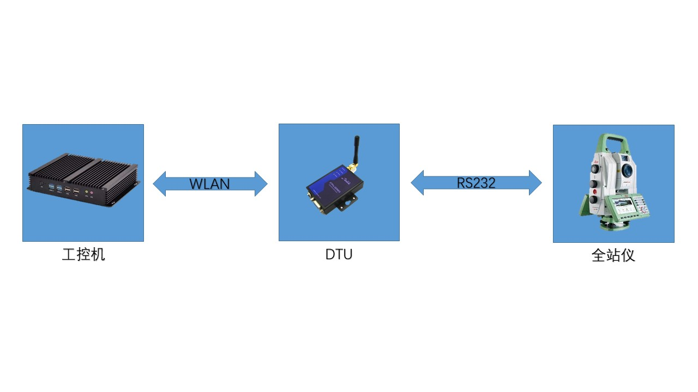

[toc]
# Theodooperation 类使用说明

## 0. 摘要：  
TheodoOperation的作用是通过本类的成员方法自动操作Leica系列全站仪，本类中的方法是通过将Leica GeoCom工具包中的ASCII命令进行二次封装，并通过TCP方式发送。

### 0.1 硬件连接：
DTU连接TCP/IP终端（工控机）与串口终端（全站仪)，解析并转发数据报文；  
工控机通过TCP/IP方式与DTU进行连接；  
全站仪通过RS232方式与DTU进行连接;
  


WLAN参数：
 - Server: DTU
 - Server IP: 192.168.1.1
 - Server Port: 10010
 - Client: 工控机
 - Client IP 192.168.1.20

串口参数：
- 波特率： 115200
- 数据位： 8
- 校验位： None
- 停止位： 1

### 0.2 软件应用：
为保证本类对象的正常运行，项目中须包含以下依赖：
- Theodo 类（theodo.h, theodo.cpp)；
- DTUOperation 类(dtuoperation.h, dtuoperation.cpp)；

Theodo 类描述了全站仪对象，包括：
- 参照Leica GeoCom参考手册定义的宏 (详见theodo.h)；
- 参照Leica GeoCom参考手册定义的枚举 (详见theodo.h)；
- 参照Leica GeoCom参考手册定义的操作命令方法 (详见theodo.h)；

以及必要的私有成员属性及方法；

DTUOperation 类描述了于全站仪的通讯方式：
- 定义TCP client对象，用以于服务器通信；
- 定义了初始化，以及读写socket的函数；

当前版本仅支持TCP/IP方式通讯，DTU作为TCP Server，本类之对象作为TCP Client;

程序设计语言为 C++ (std=C++11);  
使用QT (Version = 5.13.1) 开源框架；

## 1. 使用步骤：

### 1.1使用操作对象的方法操作全站仪对象:

- 构造全站仪对象；  
- 构造操作函数对象；  
- 直接输入操作命令和参数；  

### 1.2 构造方法：

请在应用代码中包含以下头文件：

```C++
#include "theodooperation.h"
#include "theodo.h"
#include "dtuoperation.h"
```

- 构造全站仪对象的方法：

```C++
Theodo TS60;
```

- 构造操作对象的方法：
```C++
TheodoOperation op;
```

### 1.3 使用成员方法进行操作：

#### 1.3.1 Theodo 成员属性/方法介绍：

当前版本定义的宏：
```C++
    static const uint GRC_OK = 0;
    static const uint GRC_NOT_IMPL = 5;
    static const uint GRC_NA = 27;

    static const uint GRC_AUT_SIDECOVER_ERR = 8723;
    static const uint GRC_AUT_NO_WORKING_AREA = 8720;
    static const uint GRC_AUT_NOTARGET = 8710;
    static const uint GRC_AUT_MOTOR_ERROR = 8707;
    static const uint GRC_AUT_DETECTOR_ERROR = 8713;
    static const uint GRC_AUT_NO_TARGET = 517;
    static const uint GRC_AUT_BAD_ENVIRONMENT = 8712;
    static const uint GRC_ATA_STRANGE_LIGHT = 524;
```
当前版本定义的枚举：
```C++
    // 开关:
    enum _Switch
    {
        OFF = 0,
        ON = 1
    }Switch;

    // 使能:
    enum _isEnable
    {
        DISABLE = 0,
        ENABLE = 1
    }isEnable;

    // 测量方法:
    enum _BAP_MEASURE_PROG
    {
        BAP_NO_MEAS = 0,
        BAP_NO_DIST = 1,
        BAP_DEF_DIST = 2,

        BAP_CLEAR_DIST = 5,
        BAP_STOP_TRK = 6
    }BAP_MEASURE_PROG;
```

当前版本中实现的方法：  

---

``` C++
    int AUS_SetUserLockStat(_Switch onSwitch = ON);  
    int AUT_SetSearchArea(double dCenterH, double dCenterV, double dRangeH, double dRangeV, _isEnable bEnable = ENABLE);
    int AUT_PS_EnableRange(_isEnable bEnable = ENABLE);
    int AUT_PS_SearchWindow();
    int AUT_LockIn();
    int BAP_MeasDistanceAngle(_BAP_MEASURE_PROG DistMode = BAP_DEF_DIST);
```
---
方法：int AUS_SetUserLockStat(_Switch onSwitch = ON);  
功能： 设置全站仪为跟踪方式；  
输入参数：   
```C++
    Theodo::_Switch onSwitch; //ON = 打开 OFF = 关闭
```
输出参数： 无；  

---

方法： 
    int AUT_SetSearchArea(double dCenterH, double dCenterV, double dRangeH, double dRangeV, _isEnable bEnable = ENABLE);  
功能： 设置搜索区域；  
输入参数：  
```C++
    double dCenterH; //水平方向中心点：rad
    double dCenterV; //垂直方向中心点：rad
    double dRangeH; //水平方向扫描范围：rad
    double dRangeV; //垂直方向扫描范围：rad
    Theodo::_isEnable bEnable; //使能
```
输出参数： 无；  

---

方法： 
    int AUT_PS_EnableRange(_isEnable bEnable = ENABLE);  
功能： 使能超级搜索；  
输入参数：  
```C++
    Theodo::_isEnable bEnable //ENABLE = 使能 DISABLE = 禁用
```
输出参数： 无；  

---


方法： 
    int AUT_PS_SearchWindow();  
功能： 进行超级搜索；  
输入参数： 无；  
输出参数： 无；  

---

方法： 
    int AUT_LockIn();  
功能： 设置自动跟踪棱镜；  
输入参数： 无；   
输出参数： 无；  

---
方法： 
    int BAP_MeasDistanceAngle(_BAP_MEASURE_PROG DistMode = BAP_DEF_DIST);  
功能： 设置自动跟踪棱镜；  
输入参数：  
```C++
    Theodo::_BAP_MEASURE_PROG
        // BAP_NO_MEAS : 不进行测量；
        // BAP_NO_DIST : 仅测量角度；
        // BAP_DEF_DIST : 测量角度和距离；
        // BAP_CLEAR_DIST : 清楚距离；
        // BAP_STOP_TRK = 6 : 停止跟踪；
```
输出参数： 无

---

#### 1.3.2 TheodoOperation 成员属性/方法介绍：


通过TheodoOperation::op_Theodo()方法的重载实现对全站仪对象的操作；


方法： 
int TheodoOperation::op_Theodo(Theodo& in_theodo, int (*func)(...), ...);  
功能：将命令以及参数发送给全站仪；  
输入参数：    
```C++
    /*
     * 操作方法： 将要发送的命令以函数指针方式传参, 并将参数依次传递即可；
     * 详见使用范例；
     */

    Theodo& in_theodo //  全站仪对象；
    int (*func)(...) // 成员方法指针；

```
输出参数： 详见各重载函数声明 theodooperation.h；  

---

## 2. 使用范例：

```C++
#include <QCoreApplication>
#include "theodooperation.h"
#include <iostream>

using namespace std;

int main()
{
    // 1. 构造一个Theodo类的全站仪对象：
    Theodo Ts60;
    // 2. 构造一个操作函数TheodoOperation类的对象，用于操作全站仪；
    TheodoOperation op;
    // 3. 若需记录坐标，可构造一个List对象；
    //    由于全站仪返回的坐标为(r, θ, φ)格式， 本API中提供了两种返回方式；
    //    方式1：直接返回全站仪给出的(r, θ, φ) 坐标；
    //    方式2：返回(x, y, z) 坐标；
    //    可根据需要调用不同的 op_Theodo()函数重载；
    //    本例中采用(x, y, z) 坐标方式；
    QList<std::tuple<double, double,double>> coordinations;

    // 设置跟踪方式：
    op.op_Theodo(TS60, &Theodo::AUS_SetUserLockStat, Theodo::ON );
    system("pause");

    // 设置超级搜索使能：
    op.op_Theodo(TS60, &Theodo::AUT_PS_EnableRange, Theodo::ENABLE);
    system("pause");

    // 进行超级搜索:
    op.op_Theodo(TS60, &Theodo::AUT_PS_SearchWindow);
    system("pause");

    //工作循环：
    while(1)
    {

        double x = 0, y = 0, z = 0;

        // 测量距离和角度：        
		op.op_Theodo(TS60, &Theodo::BAP_MeasDistanceAngle, Theodo::BAP_DEF_DIST, x, y, z);
        // 保存测量结果：
		coordinations.append(std::tuple<double, double, double>(x, y, z));
        // 打印测量结果：
        foreach(auto var,  coordinations)
		{
			std::cout << "x = " << get<0>(var) << endl; 
			std::cout << "y = " << get<1>(var) << endl; 
			std::cout << "z = " << get<2>(var) << endl; 
		}
		system("pause");
    }
    return 0;
}
```

